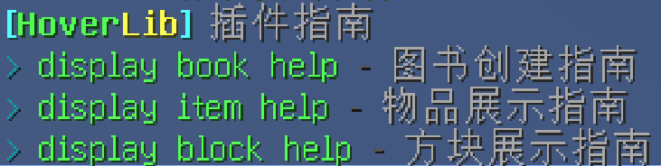
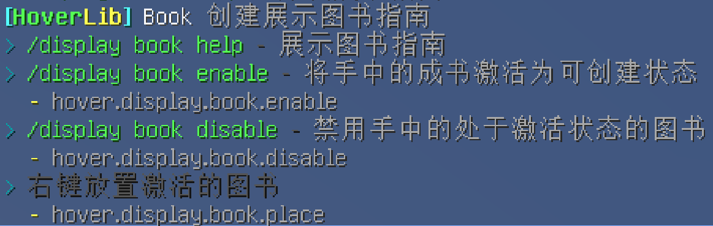
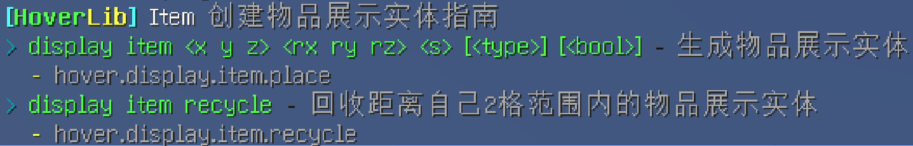
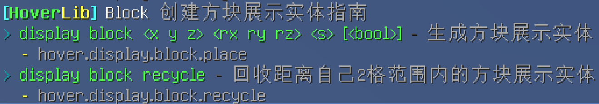

# HoverLib
## 摘要
HoverLib是基于Spigot-1.20开发的插件，理论上是支持1.19.4的。该插件为广大生存服的创作者们提供了创建（方块、物品）展示实体以及相框书架的能力。通过该插件可以更方便地创建展示实体，并控制它们的大小、旋转以及坐标，能发挥群众更多的艺术灵感创造出无限可能。

## 基本使用方法
HoverLib指令分四大模块：基本指南、相框书架指南、物品展示实体指南、方块展示实体指南。
### 基本指南
除了在基本指南中不会出现特殊的符号，其它指南中的中括号表示可选输入、尖括号为参数内容。

| 指令            | 权限                | 功能   |
|---------------|-------------------|------|
| /display      | hover.display.use | 基本指南 |
| /display help | hover.display.use | 基本指南 |



### 相框书架指南
相框书架的本质是允许玩家创建一个受保护的成书物品展示框，任何人都可以直接通过右键这个物品展示框来阅读其中的成书。创建后的成书有且仅有管理员或创建者有权破坏。

| 指令                     | 权限                         | 功能            |
|------------------------|----------------------------|---------------|
| /display book \[help\] |                            | 创建相框书架指南      |
| /display book enable   | hover.display.book.enable  | 将手持的成书变更为激活状态 |
| /display book disable  | hover.display.book.disable | 将手持的激活的成书关闭激活 |

激活后的成书可以通过右键方块将其进行生成展示，也可以随时关闭激活状态来避免误触方块。



### 物品展示实体指南
物品展示实体时1.19.4新增的实体，同类型的展示实体一共有3个，其中text_display文本展示实体已经在CMI中得到了应用。
物品展示实体允许用户创建一个没有碰撞箱的展示物品，这些实体不会占用很多的服务器性能（但也不是绝对的）。
非管理员玩家在创建时会根据配置来消耗手持物品，在回收时这些展示实体也会掉落返回给玩家。

| 指令                                                                                          | 权限                         | 功能                                                           |
|---------------------------------------------------------------------------------------------|----------------------------|--------------------------------------------------------------|
| /display item \[help\]                                                                      |                            | 创建物品展示实体指南                                                   |
| /display item \<x\> \<y\> \<z\> \<rx\> \<ry\> \<rz\> \<scale\> \[\<type\>\] \[\<boolean\>\] | hover.display.item.place   | 在坐标\<x y z\>处为手持的物品创建一个缩放为\<scale\>三轴旋转角为\<rx ry rz\>的物品展示实体 |
| /display item recycle                                                                       | hover.display.item.recycle | 回收配置中指定的半径范围内的物品展示实体                                         |



参数解释：
1. \<x\> \<y\> \<z\> 这三个变量表示了一个三维坐标（可以带小数或负号），你可以使用`~`符号来表示绝对定位，也可以使用`~-2`的形式来表示对绝对定位的偏移（偏移量只能是整数）
2. \<rx\> \<ry\> \<rz\> 这三个变量表示了该实体在三轴方向上的旋转角度（即：rotate x，rotate y，rotate z）这些变量的值必须是\(-∞,+∞\)的任意一个整数
3. \<scale\> 物品的缩放比例，该值必须是一个\[0.5, 1\]区间内的任意一个小数
4. \[\<type\>\] 是物品展示实体的模式（见：[Minecraft Wiki](https://minecraft.fandom.com/zh/wiki/%E5%B1%95%E7%A4%BA%E5%AE%9E%E4%BD%93)）用于再次变换物品模型，固定的选项为`none`（不变换）、`thirdperson_lefthand`（第三人称视角左手变换）、`thirdperson_righthand`（第三人称视角右手变换）、`firstperson_lefthand`（第一人称视角左手变换）、`firstperson_righthand`（第一人称视角右手变换）、`head`（放置在头部物品栏的变换）、`gui`（在图形界面中的变换）、`ground`（平铺在地面的变换）和`fixed`（默认变换）。默认为`fixed`。
5. \[\<boolean\>\] 这个布尔值代表是否允许其他人也回收你所放置的这个物品展示实体，默认为`false`

这里展示一个扭蛋机成品以及一部分指令（你首先得拥有一个头颅库插件）：

```text
/display item 395.3 79.15 -273.7 0 45 0 0.6
/display item 395.7 79.15 -273.7 0 60 0 0.6
/display item 395.5 79.15 -273.25 0 30 0 0.6
/display item 395.35 79.48 -273.4 0 30 0 0.6
/display item 395.75 79.48 -273.4 0 -30 -45 0.6
/display item 395.5 79.48 -273.7 0 -45 0 0.6
/display item 395.4 79.81 -273.755 0 -45 0 0.6
/display item 395.45 79.81 -273.32 0 -18 0 0.6
/display item 395.73 79.81 -273.55 0 -30 30 0.6
```


### 方块展示实体指南
了解过物品展示实体后方块展示实体其实也就是那么回事，方块实体的创建比物品实体会简单一些，因为它不具备物品的“展示实体模式”属性。
非管理员玩家在创建时会根据配置来消耗手持物品，在回收时这些展示实体也会掉落返回给玩家。

| 指令                                                                              | 权限                          | 功能                                                           |
|---------------------------------------------------------------------------------|-----------------------------|--------------------------------------------------------------|
| /display block \[help\]                                                         |                             | 创建方块展示实体指南                                                   |
| /display block \<x\> \<y\> \<z\> \<rx\> \<ry\> \<rz\> \<scale\> \[\<boolean\>\] | hover.display.block.place   | 在坐标\<x y z\>处为手持的物品创建一个缩放为\<scale\>三轴旋转角为\<rx ry rz\>的方块展示实体 |
| /display block recycle                                                          | hover.display.block.recycle | 回收配置中指定的半径范围内的方块展示实体                                         |



参数解释：
1. \<x\> \<y\> \<z\> 这三个变量表示了一个三维坐标（可以带小数或负号），你可以使用`~`符号来表示绝对定位，也可以使用`~-2`的形式来表示对绝对定位的偏移（偏移量能是整数）
2. \<rx\> \<ry\> \<rz\> 这三个变量表示了该实体在三轴方向上的旋转角度（即：rotate x，rotate y，rotate z）这些变量的值必须是\(-∞,+∞\)的任意一个整数
3. \<scale\> 物品的缩放比例，该值必须是一个\[0.5, 5\]区间内的任意一个小数
4. \[\<boolean\>\] 这个布尔值代表是否允许其他人也回收你所放置的这个方块展示实体，默认为`false`

这里展示一棵奇怪的树（指令和物品展示实体差不多这里就不赘述了）：


## 构建下载地址
本插件是开源免费的，在二次开发过程中需要遵守Apache License开源协议。本插件所用所有代码均为原创,不存在借用/抄袭/违反协议等行为。

Github：[Hover-Lib: a minecraft server plugin that allow you to open a written book from item frame](https://github.com/Mordor171/Hover-Lib)

## 更新记录
2023-06-19 初次发布插件，版本从1.1开始迭代
